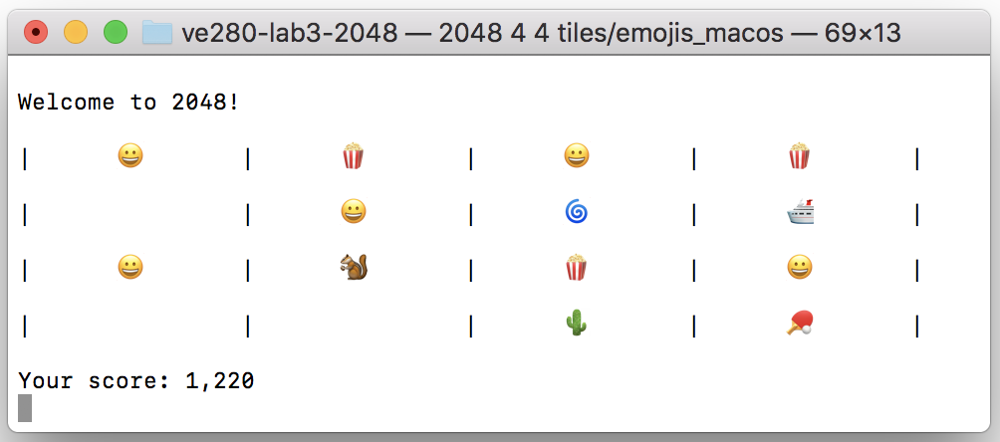

# Lab Three: 2048

## Introduction

The original version of 2048, developed by [Gabriele Cirulli](https://github.com/gabrielecirulli), is a web game written in HTML+CSS+JavaScript. You can find the source code in this [GitHub repository] (https://github.com/gabrielecirulli/2048). In this lab, we are going to develop a C++ version of 2048. It should implement most of the basic features of 2048, which include printing grid, moving tiles and accumulating score. Some exciting bonus features, such as customized tile values with Emojis and Chinese characters, will also be implemented. You'll definitely enjoy playing with it in your terminal!



## Implementation

`Game`, `Grid` and `Tile` are three major classes/structures of this project. `Game` is the high-level game manager, which determines the win/lose conditions and stores the current score. `Game` contains a `Grid` object as its private member, which is basically a two-dimensional array with grid operations such as moving tiles and collapsing tiles. The tiles array in `Game` stores all the available `Tile`s. Each element of the `Grid`'s two-dimensional array is either a `nullptr` or a pointer to one `Tile` in `Game`'s tiles array. Please refer to the header files `game.h`, `grid.h` and `tile.h` for more details.

For this lab, we have provided you with most of the input/output functions. Please read the "Compilation" section first to get your code running. You should be able to see the game interface and a grid with 8 tiles printed with colors. For now pressing arrow keys do not move those tiles, but your operation has already been converted to a `Direction` enumerate type and taken as the input to the following functions to be implemented.

1. `bool Grid::shiftTile(const Point &dst, const Point &src);`

2. `bool Grid::shiftTiles(Direction dir);`

3. `void Grid::upgradeTile(const Point &pt);`

4. `unsigned int Grid::collapseTiles(Direction dir);`

5. `bool Game::checkWin() const;`

6. `bool Game::checkLose() const;`

After implementing these 6 functions, please remove the `game.debugGrid();` statement in `2048.cpp`. Then you can compile the whole project and run the game in your terminal, together with trying customized tiles such as Chemistry Elements and Heavenly Stems. Have fun!

## Compilation

You can use IDE to write your code, but please avoid using the "Run" button or built-in terminal of IDE. Instead, use the default terminal of your operating system to compile your program.

You can utilize the `Makefile` to compile:

```
make
```

or type the following command:

```
g++ -std=c++11 -Wall -o 2048 2048.cpp direction.cpp game.cpp grid.cpp input.cpp point.cpp tile.cpp
```

Then you can run the executable:

```
./2048
```

or run with arguments:

```
./2048 <height> <width> <tiles-file>
```


## Submission

Please make a fork of the VE280 GitHub repository at <https://github.com/ve280/ve280>, then commit your updates to the files in `labs/lab3` and create a pull request. You can refer to this [tutorial](https://github.com/ve280/tutorials/blob/master/github_introduction.md#4-contribute-to-a-public-repository) on how to create pull requests.


## Acknowledgement

Lab 3 problems are designed by [Zian Ke](https://github.com/zianke) and [Tianyi Ge](https://github.com/TimothyGe).


## Reference

[1] 2048 by Gabriele Cirulli. <https://github.com/gabrielecirulli/2048>.